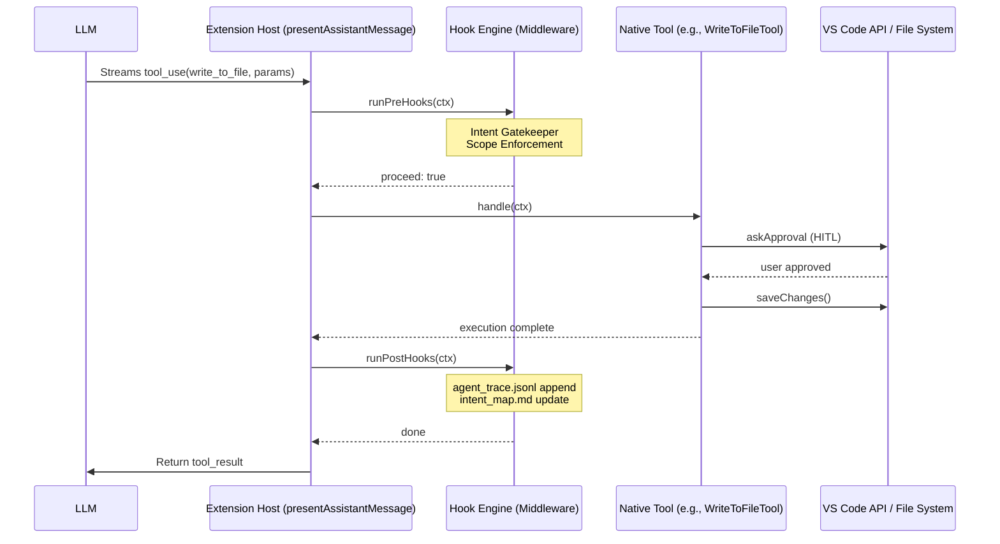

# Roo Code Architecture Notes — Phase 0: Archaeological Dig

**TRP1 Challenge Week 1: AI-Native IDE & Intent-Code Traceability**

This document captures the results of Phase 0: mapping the nervous system of the Roo Code extension for hook injection and orchestration.

---

## 1. Extension Structure Overview

```
src/
├── activate/              # Extension entry point
├── api/                   # LLM providers (OpenAI, Anthropic, etc.)
├── core/                  # Core agent logic
│   ├── assistant-message/ # Tool dispatch & presentation
│   ├── prompts/           # System prompt & tool definitions
│   ├── task/              # Task lifecycle, build-tools
│   └── tools/             # Native tool implementations
├── core/webview/          # ClineProvider (Extension Host ↔ Webview)
└── webview-ui/            # React UI (restricted presentation layer)
```

**Privilege separation (per challenge spec):**

- **Webview (UI):** Restricted presentation layer. Emits events via `postMessage`.
- **Extension Host (Logic):** Handles API polling, secret management, MCP, tool execution.
- **Hook Engine (to build):** Middleware boundary in Extension Host, wrapping tool execution.

---

## 2. Tool Loop — Where `execute_command` and `write_to_file` Are Handled

### 2.1 Entry Point: `presentAssistantMessage`

**File:** `src/core/assistant-message/presentAssistantMessage.ts`

This is the central dispatcher. It:

1. Processes content blocks from the assistant's streaming response
2. Switches on `block.type` (and `block.name` for tool_use)
3. Routes to the appropriate tool via `tool.handle(cline, block, callbacks)`
4. Passes `askApproval`, `handleError`, `pushToolResult` as callbacks

**Critical switch (lines ~580–750):**

```typescript
switch (block.name) {
  case "write_to_file":
    await checkpointSaveAndMark(cline)
    await writeToFileTool.handle(cline, block as ToolUse<"write_to_file">, {
      askApproval, handleError, pushToolResult,
    })
    break
  case "execute_command":
    await executeCommandTool.handle(cline, block as ToolUse<"execute_command">, {...})
    break
  // ... apply_diff, edit_file, read_file, etc.
}
```

### 2.2 Tool Classes

| Tool              | File                                   | Key behavior                                                               |
| ----------------- | -------------------------------------- | -------------------------------------------------------------------------- |
| `write_to_file`   | `src/core/tools/WriteToFileTool.ts`    | `askApproval` → diff UI → `saveDirectly`/`saveChanges`                     |
| `execute_command` | `src/core/tools/ExecuteCommandTool.ts` | `askApproval("command")` → `executeCommandInTerminal()`                    |
| `skill`           | `src/core/tools/SkillTool.ts`          | Loads context from SkillsManager; good template for `select_active_intent` |

All tools extend `BaseTool<TName>` and implement:

- `execute(params, task, callbacks): Promise<void>`
- Optionally `handlePartial(task, block)` for streaming

**Base flow in `BaseTool.handle()`:**

1. If `block.partial` → `handlePartial` only, return
2. Parse `block.nativeArgs` (typed params)
3. Call `execute(params, task, callbacks)`

### 2.3 HITL (Human-in-the-Loop)

`askApproval` is created per tool block in `presentAssistantMessage` (lines ~494–528). It:

- Calls `cline.ask(type, partialMessage, ...)` which shows UI and waits for user
- Returns `true` if approved, `false` if rejected
- On reject: calls `pushToolResult(formatResponse.toolDenied())`, sets `cline.didRejectTool = true`

**This is the place to add pre-approval hooks** (e.g., intent scope checks, `.intentignore`).

---

## 3. Prompt Builder — Where System Prompt Is Constructed

### 3.1 System Prompt

**File:** `src/core/prompts/system.ts`

- `generatePrompt()` builds the full system prompt
- `SYSTEM_PROMPT` is the exported async function
- **Usage:** `Task.getSystemPrompt()` calls `SYSTEM_PROMPT(...)` with context, cwd, mode, MCP, etc.

**Sections (concatenated in `generatePrompt`):**

- `roleDefinition` / `baseInstructions` (from mode)
- `markdownFormattingSection`
- `getToolUseGuidelinesSection`
- `getCapabilitiesSection`
- `getRulesSection` (cwd, settings)
- `getSystemInfoSection`
- `addCustomInstructions` (mode + global custom instructions)

### 3.2 Tool Definitions for LLM

**File:** `src/core/prompts/tools/native-tools/index.ts`

- `getNativeTools(options)` returns array of OpenAI-format tool definitions
- Individual tools: `src/core/prompts/tools/native-tools/write_to_file.ts`, `execute_command.ts`, etc.
- Schema: `{ type: "function", function: { name, description, parameters } }`

**Tool filtering:** `src/core/task/build-tools.ts`

- `buildNativeToolsArrayWithRestrictions()` filters by mode and disabled tools
- Used by API providers when building completion requests

### 3.3 Where to Inject Intent Protocol

To enforce _"You cannot write code immediately; your first action MUST be select_active_intent"_:

1. **System prompt:** Add a new section in `generatePrompt()` or `addCustomInstructions()` in `src/core/prompts/system.ts`
2. **Tool definitions:** Add `select_active_intent` in `src/core/prompts/tools/native-tools/` and register in `getNativeTools()`

---

## 4. Data Flow Summary

### 4.1 Tool Loop & Hook Interception



### 4.2 Data Model Schemas

#### .orchestration/active_intents.yaml

```yaml
active_intents:
  - id: string
    name: string
    status: "IN_PROGRESS" | "COMPLETED"
    owned_scope: string[] (glob patterns)
    constraints: string[]
    acceptance_criteria: string[]
```

#### .orchestration/agent_trace.jsonl (The Ledger)

```json
{
  "id": "uuid-v4",
  "timestamp": "ISO-8601",
  "vcs": { "revision_id": "git_sha" },
  "files": [
    {
      "relative_path": "string",
      "conversations": [
        {
          "url": "task_id",
          "contributor": { "entity_type": "AI", "model_identifier": "string" },
          "ranges": [{ "start_line": number, "end_line": number, "content_hash": "sha256:..." }],
          "related": [{ "type": "specification", "value": "INT-ID" }]
        }
      ]
    }
  ]
}
```

---

## 5. Hook Injection Points

| Phase   | What to Build                 | Where to Inject                                                                      |
| ------- | ----------------------------- | ------------------------------------------------------------------------------------ |
| Phase 1 | `select_active_intent` tool   | New tool in `core/tools/`, `core/prompts/tools/native-tools/`                        |
| Phase 1 | Context loader (Pre-Hook)     | Intercept `select_active_intent` execution; return `<intent_context>`                |
| Phase 2 | Pre-Hook on destructive tools | Before `askApproval` in `WriteToFileTool`, `ExecuteCommandTool`                      |
| Phase 2 | Scope enforcement             | Pre-Hook: check `relPath` vs `owned_scope` in `active_intents.yaml`                  |
| Phase 3 | Post-Hook on write            | After successful write in `WriteToFileTool.execute()`; append to `agent_trace.jsonl` |
| Phase 4 | Optimistic locking            | Pre-Hook: compare file hash before write; block if stale                             |

---

## 6. Key Files for Hook Implementation

| Purpose              | Path                                                    |
| -------------------- | ------------------------------------------------------- |
| Tool dispatch        | `src/core/assistant-message/presentAssistantMessage.ts` |
| Write tool           | `src/core/tools/WriteToFileTool.ts`                     |
| Execute command tool | `src/core/tools/ExecuteCommandTool.ts`                  |
| System prompt        | `src/core/prompts/system.ts`                            |
| Tool definitions     | `src/core/prompts/tools/native-tools/`                  |
| Tool filtering       | `src/core/task/build-tools.ts`                          |
| Base tool            | `src/core/tools/BaseTool.ts`                            |
| Shared tool types    | `src/shared/tools.ts`                                   |

---

## 7. Recommendations for `src/hooks/` Directory

Create a clean `src/hooks/` module with:

- `HookEngine.ts` — middleware that wraps tool execution
- `preHooks.ts` — Pre-Hook implementations (intent check, scope enforcement, stale-file check)
- `postHooks.ts` — Post-Hook implementations (agent_trace, intent_map updates)
- `orchestration/` — helpers for `.orchestration/` files (active_intents.yaml, agent_trace.jsonl, intent_map.md)
- `selectActiveIntentTool.ts` — the new tool (or wire it through the engine)

The hook engine should be invoked from `presentAssistantMessage` (around the switch) or by wrapping the `handle` call for each tool.
