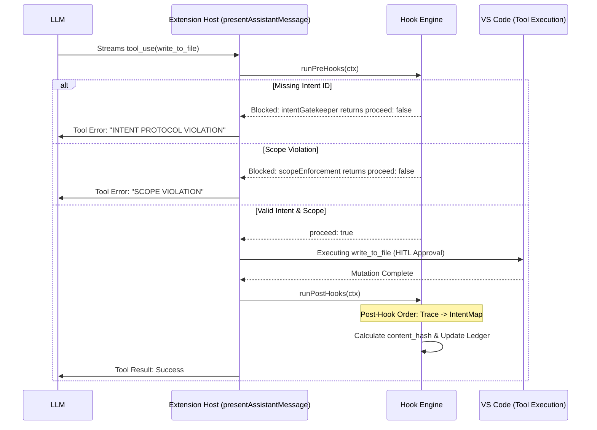

# TRP1 Challenge: Final Submission Report (AI-Native IDE)

**Date:** Saturday, February 21, 2026
**Project:** Governed AI-Native IDE (Roo Code Fork)
**Objective:** Instrumenting Roo Code with a Deterministic Hook System for Intent-Code Traceability.

For rubric-to-evidence mapping (Hook Architecture, Context Engineering, Intent-AST Traceability, .orchestration/ Artifacts, Git History), see **RUBRIC_ALIGNMENT.md** in the repository root.

---

## 1. Extension Architecture & Nervous System

The Roo Code extension is an AI-Native assistant providing a middleware layer between the user and the system. We have instrumented this layer to enforce strict governance.

### 1.1 Data Flow and Dispatchers

The lifecycle of a single interaction follows this deterministic path:

1. **User Request:** Submitted via the React Webview.
2. **Task Initialization:** `ClineProvider` instantiates a `Task`.
3. **Prompt Construction:** `SystemPrompt` is dynamically built in `src/core/prompts/system.ts`.
4. **Tool Dispatch:** `presentAssistantMessage.ts` intercepts blocks, switches on the tool name, and invokes the hook engine before execution.

### 1.2 The Hook Engine Injection Points

The `HookEngine` is called twice for every tool invocation in `presentAssistantMessage.ts`:

- **Pre-Hook Injection:** Before the `switch(block.name)` statement (around line 687). This allows the engine to block execution based on intent or scope.
- **Post-Hook Injection:** Immediately after the specific tool handle logic (around line 950), capturing the mutation result and updating the ledger.

### 1.3 Implementation Layout (`src/hooks/`)

To ensure a "Clean Middleware Pattern" as per the rubric, logic is isolated:

```text
src/hooks/
├── HookEngine.ts      # Central orchestrator / Middleware runner
├── preHooks.ts        # Intent Gatekeeper, Scope & Locking checks
├── postHooks.ts       # appendAgentTrace, updateIntentMap, recordLesson
├── index.ts           # Public exports
└── orchestration/     # Core data logic & locking
    ├── activeIntents.ts
    ├── locking.ts
    ├── types.ts
    └── index.ts
```

---

## 2. The Hook System Breakdown

### 2.1 The Interceptor Sequence (Sequence Diagram)

The following diagram illustrates the "Happy Path" vs. the "Blocked Path" enforced by our engine:



### 2.2 Tool Classification & Gatekeeping

We maintain a strict hierarchy for tool execution:

- **Safe Tools (Read-Only):** `read_file`, `list_files`, `codebase_search`. These are allowed without an intent context.
- **Destructive/Mutating Tools:** `write_to_file`, `execute_command`, `apply_diff`, `edit_file`. These are subject to the **Intent Gatekeeper** and **Scope Enforcement**.

### 2.3 Post-Hook Pipeline

After a successful mutating tool execution, the engine runs a defined pipeline:

1. **`appendAgentTrace`**: Records the mutation to the audit log.
2. **`updateIntentMap`**: Connects the physical file to the business intent.
3. **`recordLesson`**: (On tool error) Appends a "Lessons Learned" entry to `CLAUDE.md`.

---

## 3. The Handshake & Context Engineering

### 3.1 Reasoning Intercept (Handshake)

The agent is prohibited from "Vibe Coding" via a mandatory state transition:

1. **Agent selects Intent:** Calls `select_active_intent(id)`.
2. **Context Injection:** The tool returns a structured XML block injected into the immediate prompt:
    ```xml
    <intent_context id="INT-001">
      <constraints>Must handle JWT migration</constraints>
      <owned_scope>src/auth/**</owned_scope>
      <acceptance_criteria>Unit tests pass</acceptance_criteria>
    </intent_context>
    ```

### 3.2 Failure Resolution

If an agent attempts a mutating action without the handshake, the gatekeeper sends the `INTENT PROTOCOL VIOLATION` error directly back to the LLM. This forces the LLM to recognize its protocol lapse and self-correct by calling `select_active_intent` in its next turn.

---

## 4. AI-Native Tracking & Data Models

### 4.1 Intent Specification (`active_intents.yaml`)

Tracks the lifecycle of business requirements.

```yaml
active_intents:
    - id: "INT-001"
      name: "JWT Authentication Migration"
      owned_scope: ["src/auth/**"]
      constraints: ["No external auth providers"]
```

### 4.2 Audit Ledger (`agent_trace.jsonl`)

Links Code Hashes to Intent IDs for full **Spatial Independence**.

```json
{
	"id": "uuid-v4",
	"files": [
		{
			"relative_path": "src/auth/middleware.ts",
			"conversations": [
				{
					"ranges": [{ "content_hash": "sha256:7a8f..." }],
					"related": [{ "type": "specification", "value": "INT-001" }]
				}
			]
		}
	]
}
```

### 4.3 Spatial Map (`intent_map.md`)

Maps business intents to physical files for human audit.

| Intent ID | File Path              | Status | Last Modified |
| :-------- | :--------------------- | :----- | :------------ |
| INT-001   | src/auth/middleware.ts | ACTIVE | 2026-02-21    |

### 4.4 Shared Brain Schema (`CLAUDE.md` / `AGENTS.md`)

Used for automated lesson recording. When a tool fails or a constraint is violated, the system appends a structured lesson.

**Schema (Markdown Specification):**

- **Heading**: `### [Automated Lesson] - {YYYY-MM-DD}`
- **Context**: `- **Context:** Tool failure in task \`{task_id}\``
- **Issue**: `- **Issue:** {failure_reason}`
- **Resolution**: `- **Resolution:** {auto_generated_strategy}`

---

## 5. Architectural Justifications & Design Trade-offs

To solve the problem of **Governance** and **Context Management**, we made specific architectural choices compared to traditional database-backed solutions.

### 5.1 Why Sidecar YAML/JSONL vs. SQLite?

**Decision**: We chose plain-text "Sidecar" files over a local SQLite database.

- **Git-Native Traceability**: Plain text files allow the audit trail to be versioned alongside the code. This solves the **Trust Debt** problem by making the agent's reasoning artifacts part of the standard PR review process.
- **Human-in-the-Loop Auditability**: Reducing **Cognitive Debt** requires that humans can easily skim the agent's state. YAML and JSONL are human-readable without specialized database browsers.
- **Zero-Config Portability**: Ensuring the system works across any environment without external dependencies or binary drivers (Governance).

**Trade-offs**:

- _Concurrency_: SQLite provides atomic writes. We mitigated this by implementing an **Optimistic Locking** mechanism at the file level, which is more appropriate for a filesystem-based agent than a traditional DBMS.
- _Query Performance_: For massive codebases, JSONL parsing might slow down. However, the "Sidecar" pattern encourages intent-scoping (splitting data per intent), keeping file sizes manageable.

### 5.2 Middleware Boundary vs. In-Line Logic

**Decision**: Hooks are implemented as a strict middleware boundary around the tool execution loop.

- **Privilege Separation**: The core `Task` logic is unaware of the `HookEngine`, ensuring that governance rules cannot be bypassed by simple prompt injection in the core logic.
- **Unified Interface**: One engine governs all tools (Write, Execute, Read), preventing "Spaghetti Code" in the main dispatcher.

---

## 7. Achievement Summary

- **Phase 0: Archaeological Dig ✓** – Extension architecture mapped; injection points for hooks identified in `presentAssistantMessage.ts`.
- **Phase 1: The Handshake ✓** – `select_active_intent` tool and dynamic context injection implemented to enforce reasoning loops.
- **Phase 2: Hook Middleware ✓** – Central `HookEngine` implemented as a deterministic boundary between logic and side-effects.
- **Phase 3: AI-Native Git ✓** – SHA-256 spatial hashing and append-only audit ledger (`agent_trace.jsonl`) established for full traceability.
- **Phase 4: Parallel Orchestration ✓** – Optimistic locking and automated lesson recording in `CLAUDE.md` implemented to manage silicon workers.

---

## 8. Master Thinker: Reflective Analysis

### 8.1 Repaying Cognitive Debt

By implementing Intent-Code Traceability, we replace "blind acceptance" of AI code with a cryptographic trail. This addresses the core problem of **Cognitive Debt**: humans no longer need to manually reconstruct the "Why" behind 50 modified files; the system preserves the intent as a side-effect of the build.

### 8.2 Trust vs. Vibe Coding

Traditional Git tracks _what_ changed (lines of text). Our system tracks _Intent Evolution_. By linking every block hash to a requirement ID, we provide high-fidelity governance that survives file renames or refactors (Spatial Independence).

### 8.3 Limitations & Future Work

**Current Limitation:** VCS revision IDs are currently placeholders for local Git SHAs. In a production environment, this would integrate with a post-commit hook to link the agent trace to the physical Git commit.
**Next Step:** Integration with AST-aware diffing to distinguish between semantic changes and stylistic refactors mathematically.

---

## 9. Deliverable Compliance

**The Meta-Audit Video** (demonstrates the Parallel Master Thinker workflow, intent gatekeeping, and real-time ledger updates as required in Section 5 of the TRP1 specification).

**Shared Persistence:** The system utilizes `CLAUDE.md` to record lessons learned from linter/test failures, ensuring that parallel agents operate from a single "Shared Brain."
