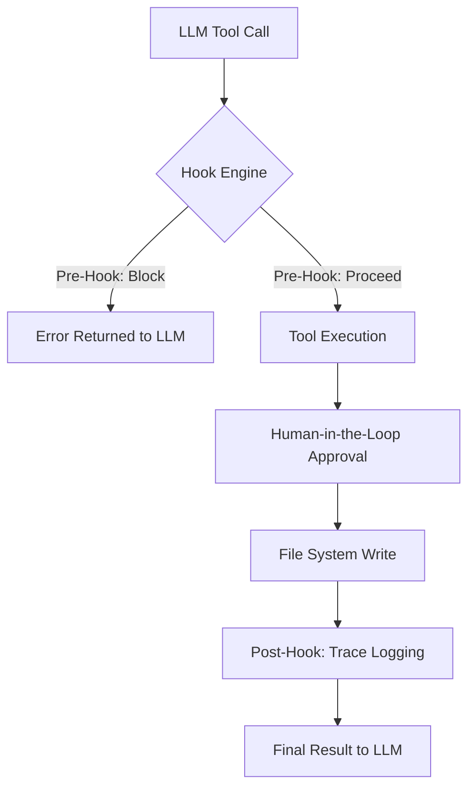

# TRP1 Challenge: Interim Submission Report

**Date:** Wednesday, February 18, 2026
**Project:** Governed AI-Native IDE (Roo Code Fork)

## 1. Extension Architecture Overview

The Roo Code extension operates on a strict privilege-separated architecture:

- **Webview UI:** A React-based presentation layer that communicates via `postMessage`.
- **Extension Host:** The core logic engine handling LLM communication, secret management, and terminal/file system orchestration.
- **Workflow Loop:** Uses a streaming asynchronous loop where LLM `tool_use` blocks are intercepted and dispatched through `presentAssistantMessage.ts`.

## 2. Hook System Design

The Hook System is implemented as a middleware layer in the Extension Host. It wraps the execution of all native tools to enforce governance and traceability.

### 2.1 Hook Phases

- **Pre-Hook (Gatekeeper):** Intercepts tool execution to verify `activeIntentId` (Intent Protocol) and enforce `owned_scope` (Scope Enforcement).
- **Post-Hook (Ledger):** Triggered after successful file modifications to log an append-only trace to `.orchestration/agent_trace.jsonl` and update the `intent_map.md`.

### 2.2 Intent Protocol (The Handshake)

We have architected a two-stage state machine for every turn:

1. **Selection:** The agent MUST call `select_active_intent(intent_id)` to load context.
2. **Action:** Only once an intent is "checked out" can the agent perform mutating actions.

## 3. Diagrams & Schemas

### High-Level Interception Flow

## 4. Current Progress Status

| Deliverable                 | Status      | Location          |
| --------------------------- | ----------- | ----------------- |
| ARCHITECTURE_NOTES.md       | Completed   | Root Directory    |
| src/hooks/ Scaffolding      | Completed   | `src/hooks/`      |
| select_active_intent (Ph 1) | In Progress | `src/core/tools/` |
| .orchestration/ Structure   | Ready       | `.orchestration/` |

## 5. Next Steps (Final Submission)

- Full implementation of the AI-Native Git Layer (Phase 3).
- Parallel Orchestration with Optimistic Locking (Phase 4).
- Final Master Thinker Demo video preparation.
