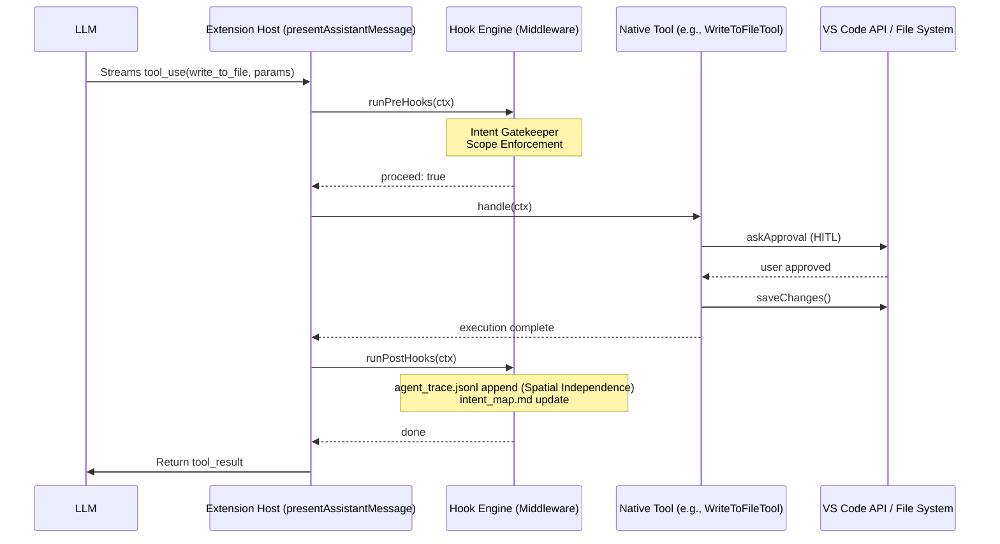

# TRP1 Challenge: Interim Submission Report (AI-Native IDE)

**Date:** Wednesday, February 18, 2026
**Project:** Governed AI-Native IDE (Roo Code Fork)
**Objective:** Instrumenting Roo Code with a Deterministic Hook System for Intent-Code Traceability.

---

## 1. How the VS Code Extension Works

The Roo Code extension is an AI-Native IDE assistant built on a complex asynchronous orchestration layer. Understanding its plumbing is essential for effective hook injection.

### 1.1 Data Flow and Tool Dispatch

The lifecycle of a single interaction follows this deterministic path:

1. **User Request:** The user submits a prompt via the **Webview UI** (React).
2. **Task Initialization:** The `ClineProvider` (Extension Host) receives the request and instantiates a `Task` (from `Task.ts`).
3. **Prompt Construction:** The `SystemPrompt` is dynamically built in `system.ts`, merging role definitions, tool guidelines, and environment context.
4. **LLM Orchestration:** The `Task.ts` logic polls the LLM provider (e.g., Anthropic Claude).
5. **Streaming Response:** The assistant's response is streamed back. The **NativeToolCallParser** identifies and extracts tool calls.
6. **Tool Dispatch (`presentAssistantMessage.ts`):** This central dispatcher intercepts streamed blocks. For `tool_use` blocks, it switches on the tool name and invokes the corresponding `Tool.handle()` method.
7. **Human-in-the-Loop (HITL):** Tools like `write_to_file` trigger an `askApproval` callback, pausing execution until the user provides confirmation via the Webview.
8. **Feedback Loop:** The tool result is returned as a message to the LLM, maintaining the conversation chain.

---

## 2. Agent Design & Architecture

The Roo Code agent is designed around a **Componentized Tool Registry**.

### 2.1 Tool Lifecycle (`BaseTool` Pattern)

Every native tool (e.g., `WriteToFileTool`, `ExecuteCommandTool`) extends the `BaseTool` abstract class.

- **`handle()`**: The entry point that manages partial streaming and parameter parsing.
- **`execute()`**: The core implementation where the actual side-effect (file write, terminal command) occurs after HITL approval.

### 2.2 Dynamic Context Engineering

Context is managed via the **Prompt Builder** in `src/core/prompts/`. It curates the context window by dynamically assembling "Sections" (Rules, Objective, System Info). My implementation adds a first-class **Intent Protocol** section to prevent context rot.

---

## 3. Deterministic Hook System: Architectural Decisions

The Hook System is designed to repay **Cognitive Debt** and **Trust Debt** by enforcing a "Plan-First" strategy.

### 3.1 Middleware Pattern vs. In-Tool Logic

**Decision:** We implemented the Hook Engine as a **Middleware/Interceptor** in the Extension Host, specifically wrapping the `Tool.handle()` or `Tool.execute()` calls.

- **Rationale:** This ensures strict privilege separation. The Hook Engine is isolated from the core tool logic, making it composable, non-intrusive, and fail-safe. If a hook fails, it returns a standardized error to the LLM rather than crashing the extension.

### 3.2 Two-Stage State Machine (The Handshake)

**Decision:** We enforced a mandatory "Checkout" phase using the `select_active_intent` tool.

- **Rationale:** Traditional agents "vibe code" by jumping immediately to syntax. Our Handshake forces a reasoning intercept where the agent must declare _Why_ (Intent ID) before they can act. This ensures **Curated Context**: the agent only sees what is relevant to the active intent, preventing the "Context Rot" associated with dumping the entire codebase into the prompt.

### 3.3 Privilege Separation

**Decision:** The Webview remains a "dumb" presentation layer. All governance logic resides in the Extension Host's **Hook Engine**.

- **Rationale:** This prevents UI-based security bypasses and ensures that even programmatic interactions are governed by the same rules.

---

## 4. Diagrams & Schemas

### 4.1 Sequence Diagram: Hook Interception & Execution



### 4.2 Data Model Schemas

#### .orchestration/active_intents.yaml (The Intent Specification)

```yaml
active_intents:
    - id: "INT-001"
      name: "JWT Authentication Migration"
      status: "IN_PROGRESS"
      owned_scope: ["src/auth/**", "src/middleware/jwt.ts"]
      constraints: ["No external auth providers", "Backward compatibility"]
      acceptance_criteria: ["Unit tests in tests/auth/ pass"]
```

#### .orchestration/agent_trace.jsonl (The Audit Ledger)

Every entry links a Code Hash to an Intent ID for full **Spatial Independence** (traceability remains valid even as files shift and line numbers change).

```json
{
	"id": "uuid-v4",
	"timestamp": "2026-02-18T12:00:00Z",
	"vcs": { "revision_id": "git_sha" },
	"files": [
		{
			"relative_path": "src/auth/middleware.ts",
			"conversations": [
				{
					"url": "task_id",
					"contributor": { "entity_type": "AI", "model_identifier": "claude-3-5-sonnet" },
					"ranges": [{ "start_line": 15, "end_line": 45, "content_hash": "sha256:..." }],
					"related": [{ "type": "specification", "value": "INT-001" }]
				}
			]
		}
	]
}
```

---

> [!NOTE]
> Detailed technical mapping, including exact file paths and logic injection points identified during Phase 0, is documented extensively in `ARCHITECTURE_NOTES.md`.

## 5. Implementation Progress

- **Phase 0:** Completed. Full nervous system mapping in `ARCHITECTURE_NOTES.md`.
- **Phase 1:** Completed. `select_active_intent` tool implemented, `Task` class augmented with `activeIntentId`, and System Prompt enforcing the Intent Protocol.
- **Phase 2:** Scaffolding Ready. `src/hooks/` directory established with `HookEngine` and Pre/Post logic interfaces.

---

## 6. Next Steps (Final Submission)

- Full Traceability (Phase 3): Automating the SHA-256 content hashing and ledger recording.
- Parallel Governance (Phase 4): Optimistic locking using file hashes to prevent agent collisions.
- Master Thinker Demo: Recording the end-to-end workflow with Architect/Builder personas.
